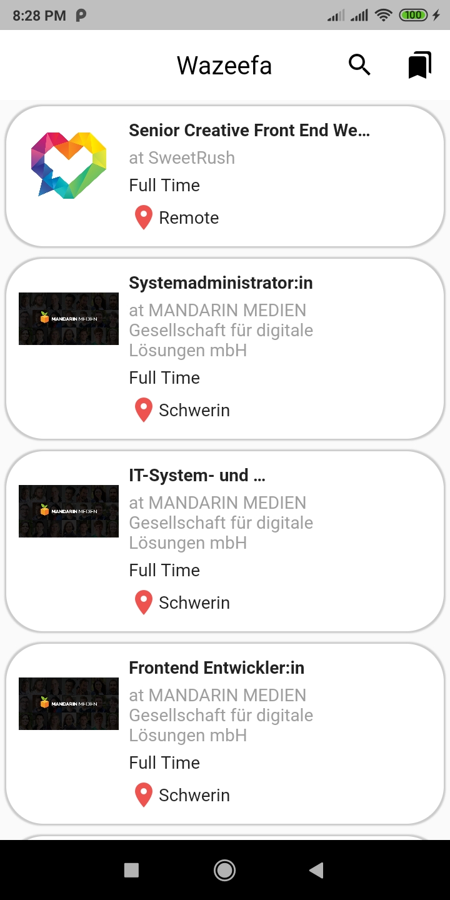
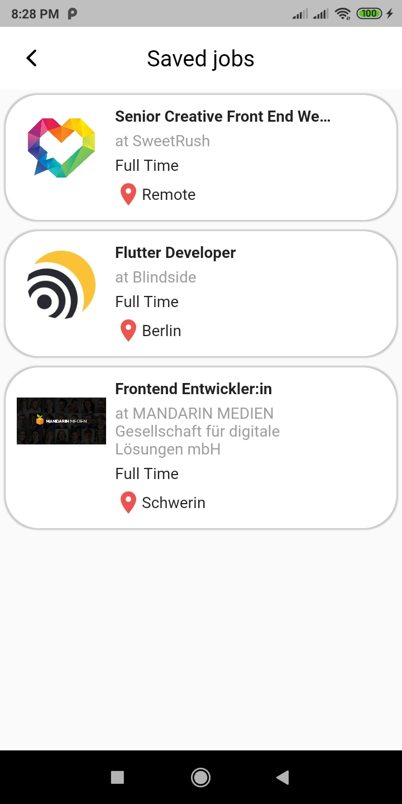
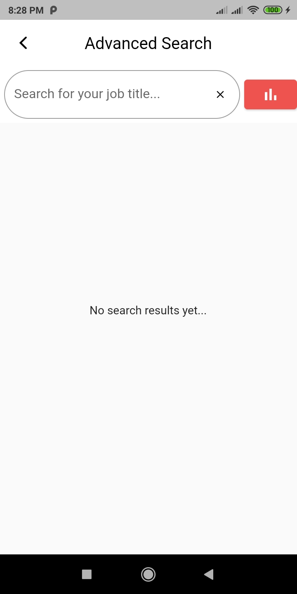
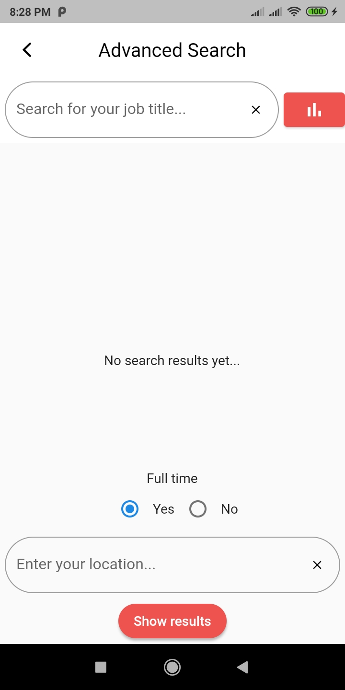
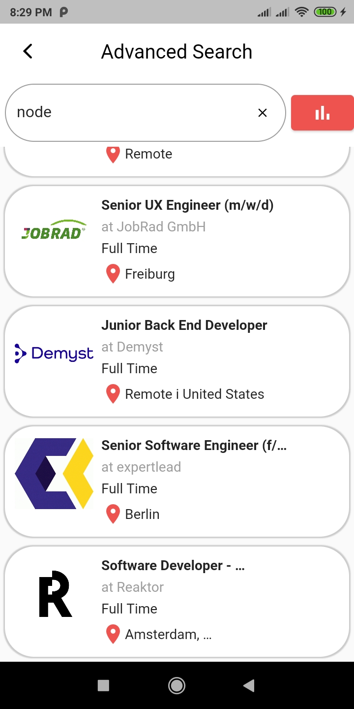

# Wazeefa

A career finder application

## Tools

* Github jobs [https://jobs.github.com] - RESTful API (Note: To be replaced)
* Web View
* Html View
* SQLite

## Gallery







## Documentation
### Fetch data from API
To fetch data from RESTful API, You need to use [http package](https://pub.dev/packages/http)
Examine the following example:

```dart
Future<List<Job>> fetchJobs() async {
  final respone = await http
      .get(Uri.parse('https://jobs.github.com/positions.json?description='));
  final parsed = jsonDecode(respone.body).cast<Map<String, dynamic>>();
  return parsed.map<Job>((json) => Job.fromJson(json)).toList();
}
```

### Search for specific data
Examine the following example:

```dart
Future<List<Job>> searchJobs(
    String description, String location, bool fullTime) async {
  String descriptionVariable =
      description.isNotEmpty ? 'description=' + description : 'description=';
  String locationVariable =
      location.isNotEmpty ? '&location=' + location : '&location=';
  String fullTimeVariable = fullTime ? '&full_time=true' : '';

  final response = await http.get(Uri.parse(
      'https://jobs.github.com/positions.json?' +
          descriptionVariable +
          fullTimeVariable +
          locationVariable));
  final parsed = jsonDecode(response.body).cast<Map<String, dynamic>>();
  return parsed.map<Job>((json) => Job.fromJson(json)).toList();
}
```

For more information, see [Fetch data from the internet](https://flutter.dev/docs/cookbook/networking/fetch-data.html) at Flutter documentation.

For the whole code, you can see [Fetch API functions code](lib/fetch_rest_api.dart)

### Store data on local device
To store data on local device, You can use SQLite database to save your data on your phone. To download the package, go to [sqflite](https://pub.dev/packages/sqflite)

```dart
static Future<Database> futureDatabase;
static Database database;

  void onDatabaseIntialize() async {
    var databasePath = await getDatabasesPath();
    String path = join(databasePath, 'saved_jobs_database.db');

    futureDatabase = openDatabase(path, onCreate: (db, version) {
      return db.execute(
          'CREATE TABLE savedJobs(jobID TEXT PRIMARY KEY, type TEXT, jobURL TEXT, createTime TEXT, companyName TEXT, companyURL TEXT, location TEXT, title TEXT, description TEXT, companyLogoURL TEXT, howToApply TEXT)');
    }, version: 1);

    database = await futureDatabase;
  }
```

To add data (in our case jobs):

```dart
Future<void> addJob(Job job) async {
    await database.insert('savedJobs', job.toDatabaseMap(),
    conflictAlgorithm: ConflictAlgorithm.replace);
}
```

To remove data:

```dart
Future<void> deleteJob(String id) async {
    await database.delete('savedJobs', where: 'jobID = ?', whereArgs: [id]);
}
```

To see the whole code, visit [Jobs Database](lib/jobs_database.dart)